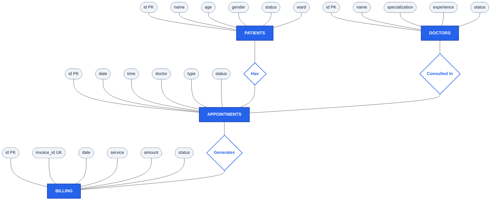
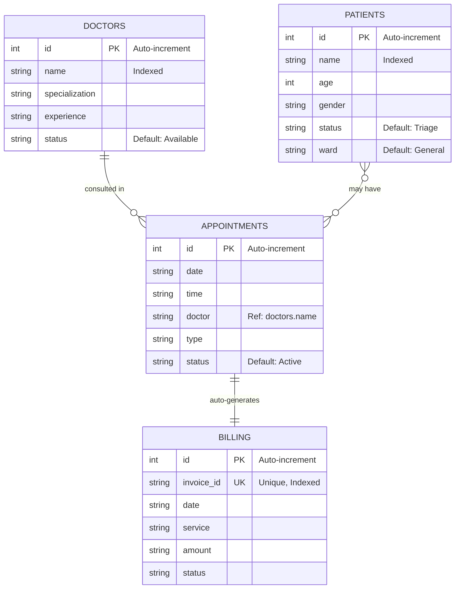

# 🏥 NovaCare — Hospital Management System

> **A full-stack Hospital Management System built with React, FastAPI, and SQLite demonstrating core DBMS concepts including CRUD operations, transaction atomicity, automated billing, and multi-language support.**

---

## 📑 Table of Contents

| Sl. No | Title | 
|--------|-------|
| 1 | [Abstract](#1-abstract) |
| 2 | [Introduction](#2-introduction) |
| 3 | [Background, Motivation and Scope](#3-background-motivation-and-scope) |
| 4 | [Methodology](#4-methodology) |
| 5 | [Requirements](#5-requirements) |
| 6 | [E-R Diagram](#6-e-r-diagram) |
| 7 | [Relational Database Design](#7-relational-database-design) |
| 8 | [Database Normalization](#8-database-normalization) |
| 9 | [Data Dictionary](#9-data-dictionary) |
| 10 | [Graphical User Interface](#10-graphical-user-interface) |
| 11 | [Source Code](#11-source-code) |
| 12 | [Conclusion](#12-conclusion) |

---

## 1. Abstract

The **NovaCare Hospital Management System** is a web-based application designed to digitize and streamline the day-to-day administrative operations of a hospital. The system manages four core entities — **Patients, Doctors, Appointments, and Billing** — stored in an **SQLite** relational database with **22 fields** across **4 normalized tables**.

The frontend is built with **React (Vite)** providing a responsive, theme-switchable (dark/light) interface with multi-language support (English, Hindi, Marathi, Tamil). The backend uses **FastAPI (Python)** to expose RESTful API endpoints that execute parameterized SQL queries against the database. A key DBMS feature demonstrated is **transaction atomicity**: when a new appointment is booked, a billing invoice is automatically generated within the same database transaction — if either INSERT fails, both are rolled back.

The project also includes a **terminal-based SQL executor** (`query.py`) that allows running raw SQL queries directly on the same database file, proving that data inserted from the terminal reflects on the frontend after a page refresh — both interfaces share a single source of truth (`hospital.db`).

---

## 2. Introduction

Hospital management involves coordinating multiple departments — patient registration, doctor scheduling, appointment booking, and financial billing. Manual record-keeping is error-prone, slow, and does not scale. A **Database Management System (DBMS)** approach addresses these challenges by providing:

- **Data Integrity** — Constraints (Primary Keys, Unique keys) prevent duplicate or invalid records.
- **Concurrent Access** — Multiple users (frontend UI + terminal) can read/write the same database.
- **Transaction Safety** — Atomic transactions ensure that linked operations (appointment + billing) either both succeed or both fail.
- **Structured Querying** — SQL provides a powerful, standardized way to retrieve, filter, and aggregate hospital data.

### Objectives

1. Design a relational database schema for a hospital with properly normalized tables.
2. Implement full **CRUD** (Create, Read, Update, Delete) operations for each module.
3. Demonstrate **transaction atomicity** via automated billing on appointment creation.
4. Build a modern, responsive web interface with dark/light theming and internationalization.
5. Provide a terminal-based SQL tool for direct database interaction and demonstration.

---

## 3. Background, Motivation and Scope

### Background

Traditional hospital management relies on paper registers and spreadsheets. These methods suffer from data redundancy, lack of referential integrity, and no support for concurrent multi-user access. Modern DBMS solutions resolve these by storing data in structured, normalized relational tables with enforced constraints.

### Motivation

- **Academic** — Demonstrate core DBMS concepts (normalization, ER modeling, SQL DML/DDL, transactions) in a practical, working application.
- **Practical** — Build a system that could realistically manage a small clinic's patient records, doctor directory, appointment scheduling, and billing.
- **Technical** — Explore the full-stack data flow from a React form → HTTP API → SQL query → SQLite file → JSON response → UI update.

### Scope

| In Scope | Out of Scope |
|----------|-------------|
| Patient registration (CRUD) | User authentication / login |
| Doctor directory with seed data | Role-based access control |
| Appointment booking with auto-billing | Prescription management |
| Invoice management and balance calculation | Insurance / claims processing |
| Dark/Light theme toggle | Mobile native app |
| Multi-language UI (EN, HI, MR, TA) | Real-time notifications |
| Terminal SQL executor (`query.py`) | Cloud deployment |
| AI chatbot assistant (NovaCare Assistant) | Advanced analytics / reporting |

---

## 4. Methodology

### Architecture — Three-Tier Model

```
┌─────────────────────────────────────────────────────────┐
│                   PRESENTATION TIER                     │
│           React (Vite) + Axios HTTP Client              │
│     Pages: Landing, Patients, Doctors, Appointments,    │
│            Billing  |  Components: Navbar, Table,       │
│            FloatingWidget (AI Chatbot)                  │
├─────────────────────────────────────────────────────────┤
│                   APPLICATION TIER                      │
│              FastAPI (Python) REST API                  │
│     Routers: patients.py, doctors.py,                   │
│              appointments.py, billing.py                │
│     Validation: Pydantic Schemas                        │
│     CORS Middleware for cross-origin requests           │
├─────────────────────────────────────────────────────────┤
│                     DATA TIER                           │
│                 SQLite (hospital.db)                    │
│     Tables: patients, doctors, appointments, billing    │
│     Raw SQL via sqlite3 module (parameterized queries)  │
│     Terminal access via query.py                        │
└─────────────────────────────────────────────────────────┘
```

### Development Approach

1. **Database-First** — Designed the ER diagram and relational schema before writing any code.
2. **API-Driven** — Backend exposes RESTful endpoints; frontend consumes them via Axios.
3. **Component-Based UI** — React components are modular and reusable (Navbar, Table, FloatingWidget).
4. **Iterative** — Each module (Patients → Doctors → Appointments → Billing) was built and tested incrementally.

### Data Flow (Example: Adding a Patient)

```
User types "Rahul Verma" → React state updates via onChange
    → Form submit fires api.post('/api/patients/', payload)
    → Axios sends POST to http://localhost:8000/api/patients/
    → FastAPI router receives request, Pydantic validates JSON
    → INSERT INTO patients (name, age, gender, status, ward) VALUES (?,?,?,?,?)
    → conn.commit() → Data saved to hospital.db
    → SELECT * FROM patients WHERE id = ? → Returns new row as JSON
    → React updates state → UI table re-renders with new patient
```

---

## 5. Requirements

### 5a. Software Requirements

| Component | Technology | Version |
|-----------|-----------|---------|
| **Frontend Framework** | React | 19.2.4 |
| **Build Tool** | Vite | 8.0.4 |
| **HTTP Client** | Axios | 1.15.0 |
| **Backend Framework** | FastAPI | Latest |
| **Language** | Python | 3.10+ |
| **Database** | SQLite | 3.x (built-in) |
| **ORM (Models only)** | SQLAlchemy | Latest |
| **Validation** | Pydantic | Latest |
| **Runtime** | Node.js | 18+ |
| **Package Manager** | npm | 9+ |

### 5b. Hardware Requirements

| Component | Minimum |
|-----------|---------|
| Processor | Intel i3 or equivalent |
| RAM | 4 GB |
| Disk Space | 500 MB |
| Display | 1280×720 resolution |

### 5c. Functional Requirements

| ID | Requirement | Module |
|----|-------------|--------|
| FR-01 | Add, view, and delete patient records | Patients |
| FR-02 | View doctor directory with auto-seeded data | Doctors |
| FR-03 | Toggle doctor availability status | Doctors |
| FR-04 | Book, reschedule, and cancel appointments | Appointments |
| FR-05 | Auto-generate billing invoice on appointment creation | Billing |
| FR-06 | View invoices, pay balance, download statement | Billing |
| FR-07 | Run raw SQL queries from terminal | query.py |
| FR-08 | Switch between dark and light themes | UI |
| FR-09 | Switch UI language (EN, HI, MR, TA) | i18n |
| FR-10 | AI chatbot for navigation assistance | FloatingWidget |

---

## 6. E-R Diagram

### 6a. Chen-Notation ER Diagram (Traditional)



**Legend:**
- 🟦 **Rectangles** = Entities (Tables)
- ⬭ **Rounded boxes** = Attributes (Columns) — `PK` = Primary Key, `UK` = Unique Key
- ◇ **Diamonds** = Relationships between entities

### 6b. Relational Schema Diagram (Table Format with Keys)



### 6c. Relationship Summary

| Relationship | Cardinality | Description |
|---|---|---|
| **Doctors → Appointments** | 1 : N (One-to-Many) | One doctor can be assigned to many appointments. `appointments.doctor` stores the doctor's name. |
| **Appointments → Billing** | 1 : 1 (One-to-One, Auto) | Every new appointment automatically creates exactly one billing invoice within the same transaction. |
| **Patients ↔ Appointments** | M : N (Many-to-Many, Logical) | Patients are associated with appointments through the UI workflow. No direct FK exists in the current schema. |

> **Note:** The schema uses the doctor's **name** (string) as the linking attribute between `appointments` and `doctors` for simplicity, rather than a foreign key ID.

---

## 7. Relational Database Design

### 7a. Schema Definitions (from `backend/models.py`)

#### Table 1: `patients`
```sql
CREATE TABLE patients (
    id       INTEGER PRIMARY KEY AUTOINCREMENT,
    name     VARCHAR NOT NULL,
    age      INTEGER,
    gender   VARCHAR,
    status   VARCHAR DEFAULT 'Triage',
    ward     VARCHAR DEFAULT 'General'
);
```

#### Table 2: `doctors`
```sql
CREATE TABLE doctors (
    id              INTEGER PRIMARY KEY AUTOINCREMENT,
    name            VARCHAR NOT NULL,
    specialization  VARCHAR,
    experience      VARCHAR,
    status          VARCHAR DEFAULT 'Available'
);
```

#### Table 3: `appointments`
```sql
CREATE TABLE appointments (
    id      INTEGER PRIMARY KEY AUTOINCREMENT,
    date    VARCHAR,
    time    VARCHAR,
    doctor  VARCHAR,
    type    VARCHAR,
    status  VARCHAR DEFAULT 'Active'
);
```

#### Table 4: `billing`
```sql
CREATE TABLE billing (
    id          INTEGER PRIMARY KEY AUTOINCREMENT,
    invoice_id  VARCHAR UNIQUE NOT NULL,
    date        VARCHAR,
    service     VARCHAR,
    amount      VARCHAR,
    status      VARCHAR
);
```

### 7b. Relational Schema (Set Notation)

```
patients     (id, name, age, gender, status, ward)
doctors      (id, name, specialization, experience, status)
appointments (id, date, time, doctor, type, status)
billing      (id, invoice_id, date, service, amount, status)
```

**Keys:**
- **Primary Keys**: `patients.id`, `doctors.id`, `appointments.id`, `billing.id`
- **Unique Key**: `billing.invoice_id`
- **Logical FK**: `appointments.doctor` → `doctors.name`

---

## 8. Database Normalization

### First Normal Form (1NF) ✅

All tables satisfy 1NF:
- Each column contains **atomic (indivisible)** values — no multi-valued or composite attributes.
- Each row is **uniquely identifiable** by its primary key (`id`).
- No **repeating groups** — each field holds a single value per row.

| Check | Satisfied? |
|-------|-----------|
| Atomic values in every column | ✅ Yes |
| Unique primary key per row | ✅ Yes |
| No repeating groups | ✅ Yes |

### Second Normal Form (2NF) ✅

All tables satisfy 2NF:
- Already in 1NF.
- Every **non-key attribute** is **fully functionally dependent** on the **entire primary key** (not on a subset).
- Since all tables use a **single-column primary key** (`id`), partial dependency is impossible.

| Table | PK | All non-key attributes depend on PK? |
|-------|-----|--------------------------------------|
| patients | id | ✅ name, age, gender, status, ward all depend on id |
| doctors | id | ✅ name, specialization, experience, status depend on id |
| appointments | id | ✅ date, time, doctor, type, status depend on id |
| billing | id | ✅ invoice_id, date, service, amount, status depend on id |

### Third Normal Form (3NF) ✅

All tables satisfy 3NF:
- Already in 2NF.
- **No transitive dependencies** — no non-key attribute depends on another non-key attribute.

| Table | Transitive Dependencies? | Explanation |
|-------|-------------------------|-------------|
| patients | ❌ None | `ward` is independently assigned, not derived from `status` |
| doctors | ❌ None | `specialization` and `experience` are independent attributes |
| appointments | ❌ None | `doctor`, `type`, `date`, `time` are all independent |
| billing | ❌ None | `amount` is not derived from `service`; `invoice_id` is unique |

### BCNF (Boyce-Codd Normal Form) ✅

Since every determinant in every table is a **candidate key** (the `id` column), all tables also satisfy BCNF.

---

## 9. Data Dictionary

### Table: `patients` — 6 Fields

| # | Field | Data Type | Constraint | Default | Description |
|---|-------|-----------|-----------|---------|-------------|
| 1 | `id` | INTEGER | PRIMARY KEY, AUTO INCREMENT | Auto | Unique patient identifier |
| 2 | `name` | VARCHAR | NOT NULL, INDEXED | — | Full name of the patient |
| 3 | `age` | INTEGER | — | — | Age in years |
| 4 | `gender` | VARCHAR | — | — | Male / Female / Other |
| 5 | `status` | VARCHAR | — | `'Triage'` | Current status: Triage, Admitted, Discharged |
| 6 | `ward` | VARCHAR | — | `'General'` | Assigned ward: General, Cardiology, ICU, Orthopedics |

### Table: `doctors` — 5 Fields

| # | Field | Data Type | Constraint | Default | Description |
|---|-------|-----------|-----------|---------|-------------|
| 1 | `id` | INTEGER | PRIMARY KEY, AUTO INCREMENT | Auto | Unique doctor identifier |
| 2 | `name` | VARCHAR | NOT NULL, INDEXED | — | Full name with title (e.g., Dr. Sarah Jenkins) |
| 3 | `specialization` | VARCHAR | — | — | Medical specialty (Cardiology, Neurology, etc.) |
| 4 | `experience` | VARCHAR | — | — | Years of experience (e.g., "15 Years") |
| 5 | `status` | VARCHAR | — | `'Available'` | Availability: Available or Booked |

### Table: `appointments` — 6 Fields

| # | Field | Data Type | Constraint | Default | Description |
|---|-------|-----------|-----------|---------|-------------|
| 1 | `id` | INTEGER | PRIMARY KEY, AUTO INCREMENT | Auto | Unique appointment identifier |
| 2 | `date` | VARCHAR | — | — | Date of appointment (YYYY-MM-DD) |
| 3 | `time` | VARCHAR | — | — | Time of appointment (HH:MM) |
| 4 | `doctor` | VARCHAR | — | — | Name of assigned doctor |
| 5 | `type` | VARCHAR | — | — | Visit type: Check-up, Follow-up, Emergency, Consultation |
| 6 | `status` | VARCHAR | — | `'Active'` | Status: Active, Completed, Cancelled |

### Table: `billing` — 6 Fields

| # | Field | Data Type | Constraint | Default | Description |
|---|-------|-----------|-----------|---------|-------------|
| 1 | `id` | INTEGER | PRIMARY KEY, AUTO INCREMENT | Auto | Unique billing record identifier |
| 2 | `invoice_id` | VARCHAR | UNIQUE, NOT NULL, INDEXED | — | Invoice number (format: INV-XXXXX) |
| 3 | `date` | VARCHAR | — | — | Billing date |
| 4 | `service` | VARCHAR | — | — | Service description (e.g., "Consultation: Check-up") |
| 5 | `amount` | VARCHAR | — | — | Amount in ₹ (e.g., "₹500.00") |
| 6 | `status` | VARCHAR | — | — | Payment status: Pending, Paid, Overdue |

### Sample Data — All 4 Tables

#### `patients`

| id | name | age | gender | status | ward |
|----|------|-----|--------|--------|------|
| 1 | Rahul Verma | 34 | Male | Admitted | Cardiology |
| 2 | Sneha Kapoor | 28 | Female | Triage | General |
| 3 | Arjun Mehta | 52 | Male | Discharged | Orthopedics |
| 4 | Priya Nair | 41 | Female | Admitted | ICU |
| 5 | Aditya Sharma | 19 | Male | Triage | General |

#### `doctors` (Auto-Seeded)

| id | name | specialization | experience | status |
|----|------|----------------|------------|--------|
| 1 | Dr. Sarah Jenkins | Cardiology | 15 Years | Available |
| 2 | Dr. Marcus Webb | Neurology | 11 Years | Booked |
| 3 | Dr. Alyssa Chen | Pediatrics | 8 Years | Available |
| 4 | Dr. Robert Frost | Orthopedics | 22 Years | Available |
| 5 | Dr. Emily Carter | Dermatology | 12 Years | Booked |
| 6 | Dr. James Mitchell | General Surgery | 19 Years | Available |
| 7 | Dr. Priya Sharma | Oncology | 14 Years | Booked |
| 8 | Dr. David Kim | Psychiatry | 9 Years | Available |

#### `appointments`

| id | date | time | doctor | type | status |
|----|------|------|--------|------|--------|
| 1 | 2026-05-20 | 10:00 | Dr. Sarah Jenkins | Check-up | Active |
| 2 | 2026-05-20 | 11:30 | Dr. Marcus Webb | Follow-up | Active |
| 3 | 2026-05-21 | 09:00 | Dr. Robert Frost | Emergency | Completed |
| 4 | 2026-05-22 | 14:00 | Dr. Alyssa Chen | Consultation | Active |
| 5 | 2026-05-23 | 16:30 | Dr. Emily Carter | Check-up | Cancelled |

#### `billing` (Auto-Generated)

| id | invoice_id | date | service | amount | status |
|----|------------|------|---------|--------|--------|
| 1 | INV-48271 | 2026-05-20 | Consultation: Check-up | ₹500.00 | Pending |
| 2 | INV-63150 | 2026-05-20 | Consultation: Follow-up | ₹500.00 | Paid |
| 3 | INV-91742 | 2026-05-21 | Consultation: Emergency | ₹500.00 | Pending |
| 4 | INV-35489 | 2026-05-22 | Consultation: Consultation | ₹500.00 | Pending |
| 5 | INV-72316 | 2026-05-23 | Consultation: Check-up | ₹500.00 | Overdue |

---

## 10. Graphical User Interface

### 10a. Pages Overview

| Page | Route | Description |
|------|-------|-------------|
| **Landing / Dashboard** | `/` | Hero section with project branding, quick-action links to Appointments, Doctors, and Billing |
| **Patients** | `/patients` | Patient directory table with "Add New Patient" form, inline delete |
| **Doctors** | `/doctors` | Medical directory with 8 seeded specialists, "Request Appointment" button per doctor |
| **Appointments** | `/appointments` | Appointment list with New/Reschedule/Cancel actions, modal form for booking |
| **Billing** | `/billing` | Invoice table, current balance card, "Make a Payment" and "Download Statement" buttons |

### 10b. UI Components

| Component | File | Purpose |
|-----------|------|---------|
| **Navbar** | `components/Navbar.jsx` | Top navigation bar with page links, language selector (EN/HI/MR/TA), dark/light theme toggle |
| **Table** | `components/Table.jsx` | Reusable data table component used across Patients, Appointments, and Billing pages |
| **FloatingWidget** | `components/FloatingWidget.jsx` | AI chatbot assistant ("Nova") with intent recognition for navigation help |

### 10c. UI Features

- **Dark / Light Theme** — Toggle via pill switch in the Navbar. Persisted in `localStorage`.
- **Multi-Language Support** — Dropdown for English, Hindi (हिंदी), Marathi (मराठी), Tamil (தமிழ்). All labels, titles, and messages are translated via `i18n.js`.
- **Responsive Layout** — Flex-based layouts that adapt to different screen widths.
- **Fade-In Animations** — Pages and components use CSS `animate-fade-in` class for smooth transitions.
- **Local Storage Persistence** — Current page, theme, and language preferences survive page refreshes via `useLocalStorage` custom hook.

---

## 11. Source Code

### 11a. Project File Structure

```
hospital-management/
├── hospital.db                  ← SQLite database file (single source of truth)
├── query.py                     ← Terminal SQL executor for demo
├── presentation.md              ← Presentation guide
├── README.md                    ← This file
│
├── backend/
│   ├── main.py                  ← FastAPI app entry point + CORS + router registration
│   ├── database.py              ← SQLite connection string + SQLAlchemy engine
│   ├── models.py                ← Table definitions (4 tables, 22 fields)
│   ├── schemas.py               ← Pydantic validation models
│   └── routers/
│       ├── patients.py          ← CRUD: Create, Read, Delete
│       ├── doctors.py           ← CRUD: Create, Read, Update + Seed (8 doctors)
│       ├── appointments.py      ← Full CRUD + Auto-billing transaction
│       └── billing.py           ← Full CRUD + Balance calculation + Seed
│
└── frontend/
    ├── package.json             ← Dependencies: React 19, Vite 8, Axios
    ├── vite.config.js           ← Vite build configuration
    ├── index.html               ← HTML entry point
    └── src/
        ├── main.jsx             ← React DOM render entry
        ├── App.jsx              ← Root component: routing, data fetching, state
        ├── App.css              ← Global styles + theme variables
        ├── index.css            ← Base CSS reset and utilities
        ├── i18n.js              ← Translations (EN, HI, MR, TA)
        ├── api/
        │   └── axios.js         ← Axios instance (baseURL: localhost:8000)
        ├── components/
        │   ├── Navbar.jsx       ← Navigation + theme toggle + language selector
        │   ├── Table.jsx        ← Reusable data table
        │   └── FloatingWidget.jsx ← AI chatbot assistant
        └── pages/
            ├── Landing.jsx      ← Dashboard / home page
            ├── Patients.jsx     ← Patient management
            ├── Doctors.jsx      ← Doctor directory
            ├── Appointments.jsx ← Appointment scheduling
            └── Billing.jsx      ← Invoice and payment management
```

### 11b. Key Code — Transaction Atomicity (Auto-Billing)

**File:** `backend/routers/appointments.py` — Lines 29–59

```python
@router.post("/", response_model=schemas.Appointment)
def create_appointment(appointment: schemas.AppointmentCreate):
    conn = get_db_connection()
    cursor = conn.cursor()
    
    try:
        # INSERT 1: Create the appointment
        cursor.execute(
            "INSERT INTO appointments (date, time, doctor, type, status) VALUES (?, ?, ?, ?, ?)",
            (appointment.date, appointment.time, appointment.doctor,
             appointment.type, appointment.status or "Active")
        )
        appointment_id = cursor.lastrowid
        
        # INSERT 2: Auto-create billing invoice
        invoice_id = f"INV-{random.randint(10000, 99999)}"
        cursor.execute(
            "INSERT INTO billing (invoice_id, date, service, amount, status) VALUES (?, ?, ?, ?, ?)",
            (invoice_id, appointment.date,
             f"Consultation: {appointment.type}", "₹500.00", "Pending")
        )
        
        conn.commit()    # Both INSERTs saved atomically
        
    except Exception as e:
        conn.rollback()  # If ANYTHING fails, BOTH are undone
        raise HTTPException(status_code=500, detail=str(e))
```

### 11c. How to Run

#### Backend
```bash
cd hospital-management/backend
pip install fastapi uvicorn sqlalchemy pydantic
uvicorn main:app --reload --port 8000
```

#### Frontend
```bash
cd hospital-management/frontend
npm install
npm run dev
```

#### Terminal SQL Executor
```bash
cd hospital-management
python query.py "SELECT * FROM patients"
python query.py "INSERT INTO patients (name, age, gender, status, ward) VALUES ('Test', 25, 'Male', 'Triage', 'General')"
```

---

## 12. Conclusion

The **NovaCare Hospital Management System** successfully demonstrates the practical application of core Database Management System concepts in a full-stack web environment:

| DBMS Concept | Implementation |
|---|---|
| **Relational Schema Design** | 4 normalized tables (patients, doctors, appointments, billing) with 22 fields |
| **Primary & Unique Keys** | Auto-increment `id` PKs; unique `invoice_id` in billing |
| **CRUD Operations** | Full Create, Read, Update, Delete across all modules |
| **Transaction Atomicity** | Appointment + Billing created in a single `commit()` / `rollback()` block |
| **Parameterized Queries** | All SQL uses `?` placeholders preventing SQL injection |
| **Data Validation** | Pydantic schemas enforce type-safe input on every API request |
| **Normalization (up to BCNF)** | No partial, transitive, or non-key functional dependencies |
| **Concurrent Access** | Both the web UI and terminal `query.py` read/write the same `hospital.db` |

### Future Enhancements

- Add **Foreign Key constraints** (`appointments.doctor_id → doctors.id`) for stricter referential integrity.
- Implement **user authentication** (JWT-based login for doctors, patients, admins).
- Add **pagination controls** in the frontend for large datasets.
- Deploy on cloud (e.g., Railway, Render) with PostgreSQL for production-grade use.
- Implement **audit logging** to track all database modifications with timestamps.

---

> **Tech Stack:** React 19 (Vite 8) • FastAPI • SQLite • Python 3.10+ • Axios • Pydantic  
> **Database:** 4 Tables • 22 Fields • BCNF Normalized • Transaction-Safe
