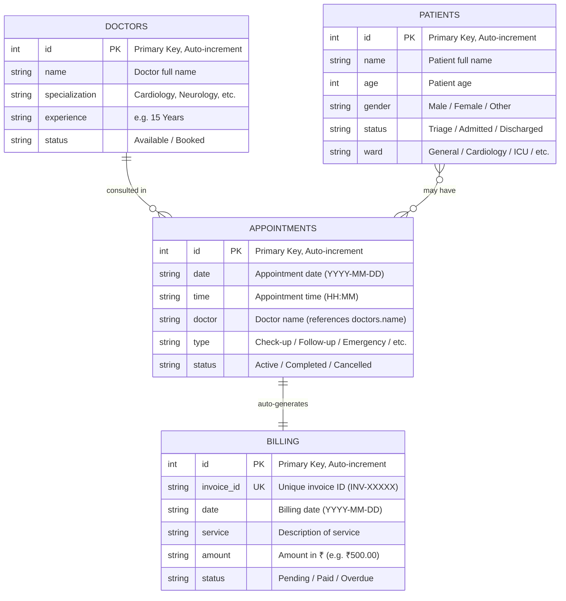

# 🏥 Hospital Management System — Presentation Guide

> **Project Name:** NovaCare Hospital Management System  
> **Tech Stack:** React (Vite) + FastAPI (Python) + SQLite  
> **Database File:** `hospital.db` (SQLite)

---

## 1. How Many Tables? How Many Fields?

### **4 Tables, 22 Total Fields**

| # | Table | Fields (Columns) | Count |
|---|-------|-------------------|-------|
| 1 | `patients` | `id`, `name`, `age`, `gender`, `status`, `ward` | **6** |
| 2 | `doctors` | `id`, `name`, `specialization`, `experience`, `status` | **5** |
| 3 | `appointments` | `id`, `date`, `time`, `doctor`, `type`, `status` | **6** |
| 4 | `billing` | `id`, `invoice_id`, `date`, `service`, `amount`, `status` | **6** |

> Defined in → `backend/models.py` (Lines 5–39)

---

## 1b. Entity-Relationship (ER) Diagram



### Relationship Details

| Relationship | Type | Description |
|---|---|---|
| **Doctors → Appointments** | One-to-Many | A doctor can have many appointments; `appointments.doctor` stores the doctor's name |
| **Appointments → Billing** | One-to-One (Auto) | Every new appointment **automatically creates** a billing entry in the same transaction (`appointments.py` L42–47) |
| **Patients ↔ Appointments** | Many-to-Many (Logical) | Patients are associated with appointments through the UI workflow; no direct FK in the current schema |

> **Note:** The current schema uses **doctor name** (string) as the link between `appointments` and `doctors` rather than a foreign key ID. This is a design choice for simplicity in this project.

---

## 1c. Sample Data (All 4 Tables)

### 🧑‍🤒 `patients` Table — Sample Data

| id | name | age | gender | status | ward |
|----|------|-----|--------|--------|------|
| 1 | Rahul Verma | 34 | Male | Admitted | Cardiology |
| 2 | Sneha Kapoor | 28 | Female | Triage | General |
| 3 | Arjun Mehta | 52 | Male | Discharged | Orthopedics |
| 4 | Priya Nair | 41 | Female | Admitted | ICU |
| 5 | Aditya Sharma | 19 | Male | Triage | General |

### 👨‍⚕️ `doctors` Table — Sample Data (Seeded)

| id | name | specialization | experience | status |
|----|------|----------------|------------|--------|
| 1 | Dr. Sarah Jenkins | Cardiology | 15 Years | Available |
| 2 | Dr. Marcus Webb | Neurology | 11 Years | Booked |
| 3 | Dr. Alyssa Chen | Pediatrics | 8 Years | Available |
| 4 | Dr. Robert Frost | Orthopedics | 22 Years | Available |
| 5 | Dr. Emily Carter | Dermatology | 12 Years | Booked |
| 6 | Dr. James Mitchell | General Surgery | 19 Years | Available |
| 7 | Dr. Priya Sharma | Oncology | 14 Years | Booked |
| 8 | Dr. David Kim | Psychiatry | 9 Years | Available |

> These 8 rows are **auto-seeded** by `doctors.py` Lines 17–40 when the table is empty.

### 📅 `appointments` Table — Sample Data

| id | date | time | doctor | type | status |
|----|------|------|--------|------|--------|
| 1 | 2026-05-20 | 10:00 | Dr. Sarah Jenkins | Check-up | Active |
| 2 | 2026-05-20 | 11:30 | Dr. Marcus Webb | Follow-up | Active |
| 3 | 2026-05-21 | 09:00 | Dr. Robert Frost | Emergency | Completed |
| 4 | 2026-05-22 | 14:00 | Dr. Alyssa Chen | Consultation | Active |
| 5 | 2026-05-23 | 16:30 | Dr. Emily Carter | Check-up | Cancelled |

### 💰 `billing` Table — Sample Data (Auto-generated)

| id | invoice_id | date | service | amount | status |
|----|------------|------|---------|--------|--------|
| 1 | INV-48271 | 2026-05-20 | Consultation: Check-up | ₹500.00 | Pending |
| 2 | INV-63150 | 2026-05-20 | Consultation: Follow-up | ₹500.00 | Paid |
| 3 | INV-91742 | 2026-05-21 | Consultation: Emergency | ₹500.00 | Pending |
| 4 | INV-35489 | 2026-05-22 | Consultation: Consultation | ₹500.00 | Pending |
| 5 | INV-72316 | 2026-05-23 | Consultation: Check-up | ₹500.00 | Overdue |

> Each billing row is **auto-created** when an appointment is booked. The `service` field is set to `"Consultation: {appointment.type}"` and the amount defaults to `₹500.00`.

---

## 2. Data Flow: Frontend → Backend → Database (THE KEY ANSWER)

### Example: **Adding a New Patient**

Below is the **exact line-by-line journey** of data when a user types a patient name in the form and clicks "Create Profile".

#### STEP 1 — User types in the Frontend Form
**File:** `frontend/src/pages/Patients.jsx`

- **Line 11** — State holds the form data:
  ```js
  const [newPatient, setNewPatient] = useState({ name: '', age: '', gender: 'Female', status: 'Triage', ward: 'General' });
  ```
- **Line 56** — User types into the input, React updates state via `onChange`:
  ```jsx
  <input type="text" value={newPatient.name} onChange={(e) => setNewPatient({...newPatient, name: e.target.value})} />
  ```

#### STEP 2 — Form Submit sends HTTP POST to Backend
**File:** `frontend/src/pages/Patients.jsx`

- **Line 13–31** — `handleAddSubmit` fires on form submit:
  ```js
  const handleAddSubmit = async (e) => {
      e.preventDefault();
      // ...validation...
      const response = await api.post('/api/patients/', newPatient);  // ← LINE 23
      setPatients([response.data, ...patients]);                     // ← LINE 24
  };
  ```
- **Line 23** — `api.post('/api/patients/', newPatient)` sends the JSON to the backend.

**File:** `frontend/src/api/axios.js`
- **Line 3–5** — Axios is configured with `baseURL: 'http://localhost:8000'`, so the full URL becomes `POST http://localhost:8000/api/patients/`

#### STEP 3 — Backend receives the request (FastAPI Router)
**File:** `backend/main.py`
- **Line 17** — The router is registered:
  ```python
  app.include_router(patients.router, prefix="/api/patients", tags=["Patients"])
  ```

**File:** `backend/routers/patients.py`
- **Line 29–45** — The POST endpoint handler:
  ```python
  @router.post("/", response_model=schemas.Patient)
  def create_patient(patient: schemas.PatientCreate):   # ← Pydantic validates the JSON
      conn = get_db_connection()
      cursor = conn.cursor()
      query = "INSERT INTO patients (name, age, gender, status, ward) VALUES (?, ?, ?, ?, ?)"  # ← LINE 34
      cursor.execute(query, (patient.name, patient.age, patient.gender, patient.status, patient.ward))  # ← LINE 35
      patient_id = cursor.lastrowid
      conn.commit()                                      # ← LINE 38: Data is NOW in the DB!
      cursor.execute("SELECT * FROM patients WHERE id = ?", (patient_id,))
      new_patient = cursor.fetchone()
      conn.close()
      return dict(new_patient)                           # ← Returns the new row as JSON
  ```

#### STEP 4 — Database stores it
**File:** `backend/database.py`
- **Line 5** — Connection string points to the SQLite file:
  ```python
  SQLALCHEMY_DATABASE_URL = "sqlite:///../hospital.db"
  ```
- The `INSERT INTO patients` SQL on **Line 34 of patients.py** writes directly to `hospital.db`.

#### STEP 5 — Response comes back to Frontend
Back in `frontend/src/pages/Patients.jsx`:
- **Line 24** — The response JSON is added to the React state and the table updates instantly:
  ```js
  setPatients([response.data, ...patients]);
  ```

### 🔁 Visual Summary
```
User types "John Doe" in form
        │
        ▼
[Patients.jsx L56]  onChange → setNewPatient({name: "John Doe"...})
        │
        ▼
[Patients.jsx L23]  api.post('/api/patients/', newPatient)
        │
        ▼
[axios.js L4]       baseURL: 'http://localhost:8000'  →  POST http://localhost:8000/api/patients/
        │
        ▼
[main.py L17]       app.include_router(patients.router, prefix="/api/patients")
        │
        ▼
[patients.py L34]   INSERT INTO patients (name, age, gender, status, ward) VALUES (?, ?, ?, ?, ?)
        │
        ▼
[patients.py L38]   conn.commit()  →  💾 Saved to hospital.db!
        │
        ▼
[patients.py L41]   SELECT * FROM patients WHERE id = ?  →  Returns new row as JSON
        │
        ▼
[Patients.jsx L24]  setPatients([response.data, ...patients])  →  🖥️ Table updates!
```

---

## 3. Terminal INSERT → Frontend Reflection

### How to demo this:

**Step 1:** Run this in terminal (uses `query.py`):
```bash
cd hospital-management
python query.py "INSERT INTO patients (name, age, gender, status, ward) VALUES ('Terminal Patient', 30, 'Male', 'Admitted', 'Cardiology')"
```
- **query.py Line 8** runs `cursor.execute(query)` and **Line 43** does `conn.commit()` — data is now in the DB.

**Step 2:** Refresh the frontend page (or navigate away and back).

**Why it reflects:** On every page load, `App.jsx` **Lines 51–76** fetches ALL data fresh from the database:
```js
useEffect(() => {
    const fetchData = async () => {
        const [patientsRes, ...] = await Promise.all([
            api.get('/api/patients/'),    // ← Line 56: GET request
            // ...
        ]);
        setPatients(patientsRes.data);    // ← Line 63: Updates the UI
    };
    fetchData();
}, []);
```

This GET request hits `backend/routers/patients.py` Line 17–27:
```python
@router.get("/")
def read_patients():
    cursor.execute("SELECT * FROM patients LIMIT ? OFFSET ?")  # ← Line 22-23
    return [dict(row) for row in patients]                      # ← Line 27: Returns ALL rows
```

> **Key point to tell sir:** The terminal and the frontend both read/write to the **same `hospital.db` file**. So any INSERT from terminal shows up on frontend after a refresh because the frontend does a fresh `SELECT *` from the same database.

---

## 4. Data Retrieval Flow (READ operation)

When the app loads, `App.jsx` Lines 51–76 fires `useEffect` which calls:

```
Frontend                         Backend                          Database
─────────                        ───────                          ────────
api.get('/api/patients/')    →   @router.get("/")             →   SELECT * FROM patients
api.get('/api/doctors/')     →   @router.get("/")             →   SELECT * FROM doctors
api.get('/api/appointments/')→   @router.get("/")             →   SELECT * FROM appointments
api.get('/api/billing/')     →   @router.get("/")             →   SELECT * FROM billing
api.get('/api/billing/balance')→ @router.get("/balance")      →   SELECT amount FROM billing WHERE status != 'Paid'
```

All 5 requests fire **in parallel** using `Promise.all` (Line 55). The returned JSON arrays populate React state (Lines 63–67), and each page component renders from that state.

---

## 5. Full CRUD Operations Per Module

### 📋 Patients — Create, Read, Delete

| Operation | Frontend Code | Backend Code | SQL Query |
|-----------|--------------|--------------|-----------|
| **CREATE** | `Patients.jsx L23`: `api.post('/api/patients/', newPatient)` | `patients.py L34` | `INSERT INTO patients (name, age, gender, status, ward) VALUES (?,?,?,?,?)` |
| **READ** | `App.jsx L56`: `api.get('/api/patients/')` | `patients.py L22` | `SELECT * FROM patients LIMIT ? OFFSET ?` |
| **DELETE** | `Patients.jsx L37`: `api.delete('/api/patients/${id}')` | `patients.py L60` | `DELETE FROM patients WHERE id = ?` |

### 👨‍⚕️ Doctors — Create, Read, Update + Seed Data

| Operation | Frontend Code | Backend Code | SQL Query |
|-----------|--------------|--------------|-----------|
| **CREATE** | `Doctors.jsx L33`: `api.post('/api/appointments/', payload)` | `doctors.py L59-61` | `INSERT INTO doctors (...) VALUES (?,?,?,?)` |
| **READ** | `App.jsx L57`: `api.get('/api/doctors/')` | `doctors.py L48` | `SELECT * FROM doctors LIMIT ? OFFSET ?` |
| **UPDATE** | Status toggle | `doctors.py L85` | `UPDATE doctors SET status = ? WHERE id = ?` |
| **SEED** | Auto on first load | `doctors.py L17-40`: Inserts 8 doctors if table is empty | `INSERT INTO doctors ... (8 rows)` |

### 📅 Appointments — Full CRUD + Auto-Billing

| Operation | Frontend Code | Backend Code | SQL Query |
|-----------|--------------|--------------|-----------|
| **CREATE** | `Appointments.jsx L70`: `api.post('/api/appointments/', payload)` | `appointments.py L36-38` | `INSERT INTO appointments (...) VALUES (?,?,?,?,?)` |
| **READ** | `App.jsx L58` | `appointments.py L23` | `SELECT * FROM appointments` |
| **UPDATE** | `Appointments.jsx L49`: `api.put(...)` (Reschedule) | `appointments.py L73-75` | `UPDATE appointments SET date=?, time=?, ... WHERE id=?` |
| **DELETE** | `Appointments.jsx L26`: `api.delete(...)` | `appointments.py L97` | `DELETE FROM appointments WHERE id = ?` |

> **⚠️ IMPORTANT — Auto-Billing Logic** (`appointments.py` Lines 42–47): When a new appointment is created, a billing invoice is **automatically** generated in the same transaction. This is a great DBMS concept to highlight — **transaction atomicity** with `conn.commit()` and `conn.rollback()`.

### 💰 Billing — Full CRUD + Balance Calculation

| Operation | Frontend Code | Backend Code | SQL Query |
|-----------|--------------|--------------|-----------|
| **CREATE** | `Billing.jsx L59`: `api.post('/api/billing/', newInvoice)` | `billing.py L53-55` | `INSERT INTO billing (...) VALUES (?,?,?,?,?)` |
| **READ** | `App.jsx L59` | `billing.py L42` | `SELECT * FROM billing` |
| **UPDATE** | `Billing.jsx L81`: `api.put(...)` (Edit invoice / Pay All) | `billing.py L79-81` | `UPDATE billing SET ... WHERE id = ?` |
| **BALANCE** | `App.jsx L60` | `billing.py L97` | `SELECT amount FROM billing WHERE status != 'Paid'` |

---

## 6. Automated Billing — Detailed Breakdown

**File:** `backend/routers/appointments.py` — Lines 29–59

When you book an appointment, **TWO inserts** happen in one transaction:

```python
# LINE 36-38: First INSERT — Create the appointment
cursor.execute(
    "INSERT INTO appointments (date, time, doctor, type, status) VALUES (?, ?, ?, ?, ?)",
    (appointment.date, appointment.time, appointment.doctor, appointment.type, appointment.status or "Active")
)

# LINE 42-47: Second INSERT — Auto-create billing invoice
invoice_id = f"INV-{random.randint(10000, 99999)}"
cursor.execute(
    "INSERT INTO billing (invoice_id, date, service, amount, status) VALUES (?, ?, ?, ?, ?)",
    (invoice_id, appointment.date, f"Consultation: {appointment.type}", "₹500.00", "Pending")
)

# LINE 49: Both saved together
conn.commit()

# LINE 56-59: If ANYTHING fails, BOTH are undone
except Exception as e:
    conn.rollback()    # ← Transaction atomicity!
```

**What to say:** "1 user action (book appointment) → 2 database inserts (appointments + billing) → 1 commit → guaranteed consistency. This is **transaction atomicity**."

---

## 7. Project Overview (1-Minute Explanation Script)

> "This is **NovaCare**, a Hospital Management System built with **React** on the frontend, **FastAPI (Python)** as the backend, and **SQLite** as the database.
> 
> It has **4 database tables** — Patients, Doctors, Appointments, and Billing — with a total of **22 fields**.
> 
> The app supports **full CRUD operations**: you can Create, Read, Update, and Delete records. For example, when I add a patient from the UI, React sends a POST request via Axios to the FastAPI backend, which executes an INSERT SQL query on the SQLite database. The new row is returned as JSON and the UI updates instantly.
> 
> A special DBMS feature is **automated billing**: when you book an appointment, the backend automatically creates a billing invoice in the **same database transaction** — if anything fails, both operations are rolled back.
> 
> The app also has a **terminal query tool** (`query.py`) that lets you run raw SQL — like INSERT or SELECT — directly on the database. Since both the frontend and terminal use the same `hospital.db` file, changes from the terminal show up on the frontend after a refresh.
> 
> Additional features include **dark/light theme**, **multi-language support** (English, Hindi, Spanish), **input validation** (patient names must be alphabets only), and **statement download** for billing."

---

## 8. Quick Reference: File Map

| Layer | File | Purpose |
|-------|------|---------|
| **DB Config** | `backend/database.py` | SQLite connection string |
| **Models** | `backend/models.py` | Table definitions (4 tables) |
| **Schemas** | `backend/schemas.py` | Pydantic validation models |
| **Entry** | `backend/main.py` | FastAPI app + CORS + router registration |
| **Routers** | `backend/routers/patients.py`, `doctors.py`, `appointments.py`, `billing.py` | API endpoints with SQL queries |
| **API Client** | `frontend/src/api/axios.js` | Axios instance (baseURL: localhost:8000) |
| **App Root** | `frontend/src/App.jsx` | Data fetching + routing + state management |
| **Pages** | `frontend/src/pages/Patients.jsx`, `Doctors.jsx`, `Appointments.jsx`, `Billing.jsx` | UI + CRUD handlers |
| **Terminal** | `query.py` | Raw SQL executor for demo |
